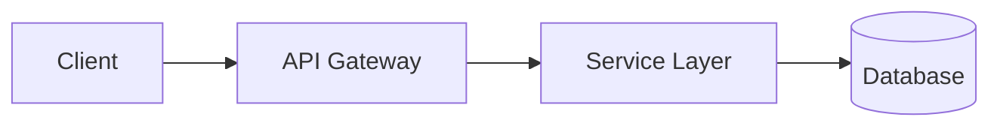

# ARCHITECTURE

> 시스템 구조의 진실의 원천. 큰 그림과 핵심 경계만.

## System Diagram

## Data Flow

TODO: 주요 요청 경로 1-2개의 시퀀스 다이어그램.

## Module Boundaries

| 모듈 | 책임 | 의존 |
|---|---|---|
| `UserService` | 사용자 도메인 로직 | `UserRepository` |
| `UserRepository` | DB 접근 (`Repository Pattern`) | `Database` |

## Design Patterns

- `Repository Pattern` — 도메인 ↔ 인프라 분리
- `CQRS` — 읽기/쓰기 모델 분리 (해당 시)
- `Event Sourcing` — 상태 변경을 이벤트로 (해당 시)

## Major Decisions

`doc/adr/` 참조.